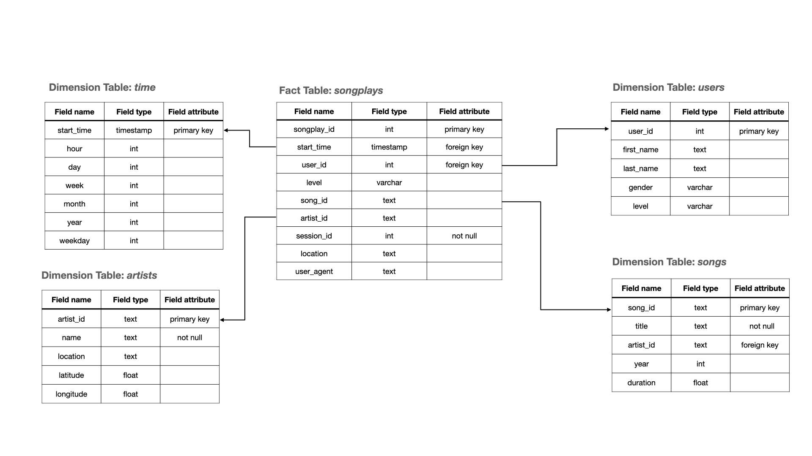

 [![Contributors][contributors-shield]][contributors-url] [![Stargazers][stars-shield]][stars-url] [![Forks][forks-shield]][forks-url] [![Issues][issues-shield]][issues-url] [![MIT License][license-shield]][license-url] [![LinkedIn][linkedin-shield]][linkedin-url]

<br />
<p align="center">
    <a href="https://github.com/najuzilu/CDW-AWSRedshift">
        
    </a>
    <h3 align="center">Cloud Data Warehouse with AWS Redshift</h3>
</p>

## About the Project

Sparkify has grown their user base and song database and want to move their processes and data onto the cloud. Their data resides in S3, in a directory of JSON logs on user activity on the app, as well as a directory with JSON metadata on the songs in their app.

They'd like a data engineer to build an ETL pipeline that extracts their data from S3, stages them in Redshift, and transforms data into a set of dimensional tables for their analytics team to continue finding insights in what songs their users are listening to. You'll be able to test your database and ETL pipeline by running queries given to you by the analytics team from Sparkify and compare your results with their expected results.

## Description

In this project, you will move Sparkify's processes and data onto the cloud. Specifically, you will build ETL pipelines that extract data from S3 and stage them in Redshift, while transforming the data into a set of dimensional tables to allow Sparkify's analytical team to explore user song preferences and find insights.

### Tools

* python
* AWS
* Redshift

## Datasets

You will work with two datasets that reside in S3. Here are the S3 links for each dataset:
* Song data: `s3://udacity-dend/song_data`
* Log data: `s3://udacity-dend/log_data`
    * Log data JSON path: `s3://udacity-dend/log_json_path.json`.

The song dataset contains a subset of the [Million Song Dataset](http://millionsongdataset.com/). Each file is in JSON format and contains metadata about a song and the artist of that song. The files are partitioned by the first three letters of each song's track ID like so:

```text
song_data/A/B/C/TRABCEI128F424C983.json
song_data/A/A/B/TRAABJL12903CDCF1A.json
```

This is what the content of each JSON file looks like:
```json
{"num_songs": 1, "artist_id": "ARJIE2Y1187B994AB7", "artist_latitude": null, "artist_longitude": null, "artist_location": "", "artist_name": "Line Renaud", "song_id": "SOUPIRU12A6D4FA1E1", "title": "Der Kleine Dompfaff", "duration": 152.92036, "year": 0}
```

The log dataset contains simulated app activity logs from a music streaming app based on configuration settings. The log files are partitioned by year and month, like so:

```text
log_data/2018/11/2018-11-12-events.json
log_data/2018/11/2018-11-13-events.json
```

Here is an example of what the data in the log file looks like.


## ERD Model

You will use the _star database schema_ as data model for this ETL pipeline, which contains fact and dimension tables. An entity relationship diagram is shown below.



## Getting Started

Clone this repository

```bash
git clone https://github.com/najuzilu/CDW-AWSRedshift.git
```

### Prerequisites

* conda
* python 3.8
* psycopg2
* boto3
* json
* botocore
* configparser

Create a virtual environment through Anaconda using

```bash
conda env create --file environment.yml
```

## Project Steps

1. Use `dwh_example.cfg` to create and populate a `dwh.cfg` file with the AWS Access Key and Secret Key fields.
2. Run `create_tables.py` to create a new Redshift cluster on AWS and tables.
    ```bash
    python create_tables.py
    ```
3. Run `etl.py` to load the data from S3 to staging tables in Redshift and insert data from staging tables to final tables.
    ```bash
    python etl.py
    ```
    The pipeline will also execute test queries to make sure the tables have been populated.

## Authors

Yuna Luzi - @najuzilu

## License

Distributed under the MIT License. See `LICENSE` for more information.

<!-- Links --->

[contributors-shield]: https://img.shields.io/github/contributors/najuzilu/CDW-AWSRedshift.svg?style=flat-square
[contributors-url]: https://github.com/najuzilu/CDW-AWSRedshift/graphs/contributors
[forks-shield]: https://img.shields.io/github/forks/najuzilu/CDW-AWSRedshift.svg?style=flat-square
[forks-url]: https://github.com/najuzilu/CDW-AWSRedshift/network/members
[stars-shield]: https://img.shields.io/github/stars/najuzilu/CDW-AWSRedshift.svg?style=flat-square
[stars-url]: https://github.com/najuzilu/CDW-AWSRedshift/stargazers
[issues-shield]: https://img.shields.io/github/issues/najuzilu/CDW-AWSRedshift.svg?style=flat-square
[issues-url]: https://github.com/najuzilu/CDW-AWSRedshift/issues
[license-shield]: https://img.shields.io/badge/License-MIT-yellow.svg
[license-url]: https://github.com/najuzilu/CDW-AWSRedshift/blob/master/LICENSE
[linkedin-shield]: https://img.shields.io/badge/-LinkedIn-black.svg?style=flat-square&logo=linkedin&colorB=555
[linkedin-url]: https://www.linkedin.com/in/yuna-luzi/
